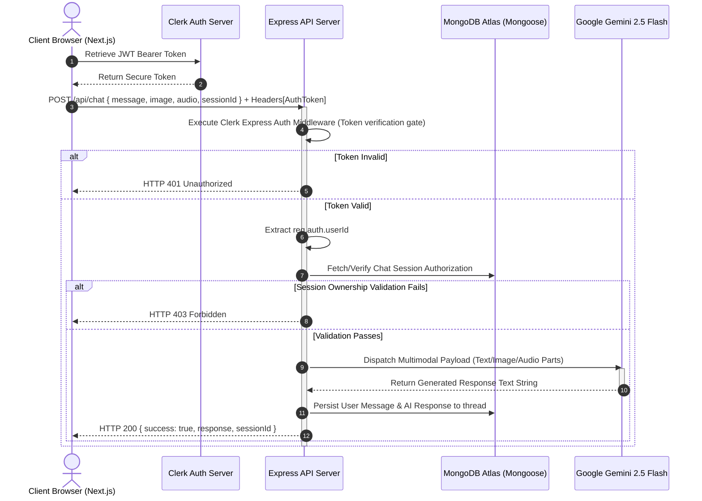

# 🌌 NexAI — Advanced Multimodal SaaS Chatbot Clone

<p align="center">
  
  
  
  
  
  
  
</p>

> **NexAI** is an enterprise-grade, full-stack conversational platform that meticulously reverse-engineers the official Google Gemini Advanced user interface. 
> Engineered with a robust distributed session model, token verification gates, client-side media buffering, and dynamic runtime content parsing, this system showcases absolute production-ready SaaS capabilities.

---

## 📊 Core Features Matrix

| Feature | Technical Description | Integration Stack |
| :--- | :--- | :--- |
| **Secure User Management** | Enforces authentication check-points using cryptographic token verification gates on all API routers. Seamlessly syncs user profiles through secure JWT validation hooks and protects dynamic UI routes. | Clerk Authentication SDK (`@clerk/nextjs`), Clerk Node Gateway (`@clerk/clerk-sdk-node`), React 19 Auth Context Hooks |
| **Persistent Thread Isolation** | Manages multi-session databases by isolating active conversation states on a per-user basis. Utilizes dynamic thread retrieval mapping through unique session identifiers, automatically persisting histories and layouts. | MongoDB Atlas, Mongoose Document Schemas, Express.js Router controller layers |
| **Multimodal Vision Integration** | Serializes user-attached image assets (drag/drop or file picker) into standard Base64 data buffers. Transmits binary payloads directly inside JSON requests to bypass intermediate storage latency. | HTML5 FileReader API, Gemini 2.5 Flash Multimodal Engine (`inlineData` base64 structure) |
| **Real-time Audio Processing** | Captures live voice prompts directly through the user's browser using client-side Web Audio buffering. Accumulates raw audio bytes into Base64-encoded WebM segments for high-fidelity speech inference. | HTML5 MediaStream & MediaRecorder API, HTML5 Audio Playback Nodes |
| **High-Fidelity UI/UX** | Replicates the premium Google Gemini Advanced look-and-feel. Features carbon-themed custom radial matrix gradients, interactive glowing inputs, dynamic skeleton shimmers, and active voice playback waves. | Tailwind CSS 3.4 (custom HSL palettes), Lucide Vector Icons, CSS-customized scrollbars |

---

## 🛠️ Tech Stack Breakdown

### Frontend Layer
- **Next.js 15+ & Turbopack**: Anchors the client-side single-page UI, leveraging Next.js file-system routing and optimized compilation cycles.
- **React 19**: Manages high-performance application state lifecycle loops, using references (`useRef`), state managers (`useState`), and custom event handlers for asynchronous stream feeds.
- **Clerk Context Architecture**: Embeds user session parameters globally, exposing reactive authentication hooks and the premium interactive `<UserButton />` and `<SignOutButton>` nodes.
- **Tailwind CSS 3.4**: Builds a sleek dark mode UI utilizing custom HSL color palettes (`#0b0c10` and `#111217`), glassmorphic backdrop filters, custom animations (`animate-pulse`), and absolute element placement.

### Backend Gateway Layer
- **Node.js & Express.js 4.x**: Implements an asynchronous gateway API that handles routing, request interceptors, and response dispatches.
- **High-Threshold Payload Parser**: Overrides default Express body boundaries to accept up to **50MB** JSON payloads, resolving potential payload limit failures for base64 file transfers.
- **Clerk Express Authentication Middleware**: Hooks directly into incoming HTTP requests to parse JWT authorization headers and populate security contexts, acting as a token verification gate.
- **Google Generative AI Core SDK**: Powers the backend LLM wrapper, feeding user-supplied prompt configurations and inline multimedia base64 streams directly into the `gemini-2.5-flash` model.

### Storage & Cloud Assets
- **MongoDB Atlas**: Serves as the primary distributed database, storing persistent session logs and message threads.
- **Mongoose ORM**: Enforces document integrity via strict Schemas:
  - **`ChatSession` Schema**: Links session metadata, unique `sessionId` hashes, and the owner's Clerk `userId`.
  - **`Message` Schema**: Models conversational items, supporting text, base64 images, and base64 audio records.

---

## 📐 System Architecture Data Flow



---

## 📅 10-Days Development History Log

### Day 1: Project Repository Init & Local Dev Environment Anchoring
- Initialized the root repository structure and separated frontend/backend application boundaries.
- Wired Next.js 15 and Express.js 4.x packages, anchoring standard configuration modules.
- Formulated the CSS compiler pipeline, linking custom PostCSS modules and Tailwind utilities.

### Day 2: Distributed Datastore Connection & Database Modeling
- Spawned a secure MongoDB Atlas cluster and set up a persistent mongoose connection pool.
- Architected the Mongoose database schemas (`ChatSession` and `Message`), defining clear structures for text logs and media properties.
- Configured indexes to facilitate rapid query lookups during conversational history retrieval.

### Day 3: Theme Reverse-Engineering & Carbon Layouts
- Designed the UI based on Google Gemini Advanced aesthetics, implementing HSL variables for dark surfaces, background gradients, and sleek sidebar drawers.
- Created modular layout components, including sidebar session triggers, main chat viewports, and glassmorphic textareas.
- Added responsive layouts that adapt dynamically to viewport width adjustments.

### Day 4: Google Gen AI Core SDK Integration
- Embedded the `@google/generative-ai` package and wrote service wrappers for `gemini-2.5-flash`.
- Created backend endpoint routing (`POST /api/chat`) to parse prompt parameters, generate response text, and return outputs.
- Tested the connection with raw terminal calls to verify latency boundaries and network stability.

### Day 5: Dynamic Sidebar Session Navigation & Memory Isolation
- Created session-indexing REST endpoints (`GET /api/chat/sessions`) to pull database records linked to the user.
- Integrated sidebar handlers to list historical chat threads and reload message components on user click.
- Implemented isolated session state management on the client to ensure prompts update the correct thread.

### Day 6: Clerk Engine Initialization & Cryptographic Security Gates
- Wrapped the Next.js client layout inside Clerk Providers to manage browser authentication states.
- Mounted security check-points on the backend using the Clerk Express SDK, protecting database access endpoints.
- Handled bearer verification headers, mapping verified Clerk identities onto MongoDB search criteria.

### Day 7: Deprecated Config Migrations & Safety Enhancements
- Migrated legacy Clerk configuration parameters to the modern `secretKey` option to resolve authorization warnings.
- Fixed backend database crashes by validating request payloads and returning 401 statuses instead of letting unauthenticated operations fail at the database level.
- Cleaned up the bottom-left sidebar layout to render the Clerk `<UserButton />` and `<SignOutButton>` profiles.

### Day 8: Image Multimodal Serialization & Payload Limit Tuning
- Implemented file picker wrappers to convert user-selected images into Base64 data strings using `FileReader`.
- Upgraded the Express payload size limits to **50MB** in `server.js` to prevent `413 Payload Too Large` errors from large image uploads.
- Configured the frontend to render uploaded image bubbles inline within the message flow.

### Day 9: Browser MediaRecorder API Integrations & Audio Compilation
- Added client-side audio capture utilizing standard browser MediaRecorder APIs, tracking recording status in React states.
- Enabled conversion of recorded WebM audio chunks into Base64 streams for prompt delivery.
- Built backend compilation logic to format base64 audio data as an inline part for the Gemini API, and rendered an HTML5 audio playback node next to user voice notes.

### Day 10: Code Optimization, Build Compliance & Ledger Verification
- Removed redundant debugging console logs and resolved React console warnings concerning deprecated Clerk buttons.
- Conducted production build tests on both the Next.js frontend (`npm run build`) and Express backend, verifying zero compilation errors.
- Completed the repository documentation ledger.

---

## 🔑 Blueprint Environment Keys & Setup Manual

### Frontend Environment (`frontend/.env.local`)
Create this file in the `frontend` folder to connect to Clerk and target the backend API:
```env
# Clerk Authentication Keys
NEXT_PUBLIC_CLERK_PUBLISHABLE_KEY=pk_test_xxxxxxxxxxxxxxxxxxxxxxxx
CLERK_SECRET_KEY=sk_test_xxxxxxxxxxxxxxxxxxxxxxxxxxxx

# API Endpoint Target
NEXT_PUBLIC_BACKEND_URL=http://localhost:5000
```

### Backend Environment (`backend/.env`)
Create this file in the `backend` folder to configure the database, API keys, and server port:
```env
# Server Network Parameters
PORT=5000

# Distributed Datastore URI
MONGO_URI=mongodb+srv://<db_user>:<db_password>@cluster.mongodb.net/nexai?retryWrites=true&w=majority

# Clerk Security Secret Key
CLERK_SECRET_KEY=sk_test_xxxxxxxxxxxxxxxxxxxxxxxxxxxx

# Google Gemini API Credentials
AI_API_KEY=AIzaSyxxxxxxxxxxxxxxxxxxxxxxxxxxxxxx
```

---

### Step-by-Step Installation Manual

1. **Clone the Source Tree**:
   ```bash
   git clone <repository-url>
   cd chatbot-app
   ```

2. **Initialize the Backend Gateway**:
   ```bash
   cd backend
   npm install
   # Populate the backend/.env file according to the blueprints above
   npm run dev
   ```

3. **Initialize the Next.js Client**:
   ```bash
   cd ../frontend
   npm install
   # Populate the frontend/.env.local file according to the blueprints above
   npm run dev
   ```

4. **Access the Application**:
   Navigate your browser to `http://localhost:3000` to interact with NexAI.

---

## 📢 Production Notices

> [!WARNING]
> **Payload Limit Boundary**: The Express backend body parser has a maximum processing capability of **50MB**. Uploading files that exceed this limit will result in an HTTP 413 error payload. The frontend is configured to capture this error and notify the user rather than crashing the interface.

> [!TIP]
> **Microphone Hardware Permissions**: The browser MediaRecorder API requires explicit user permission to capture local microphone streams. If the user denies permission, the interface will catch the error, log a warning in the console, and reset the voice prompt state without disrupting the session.